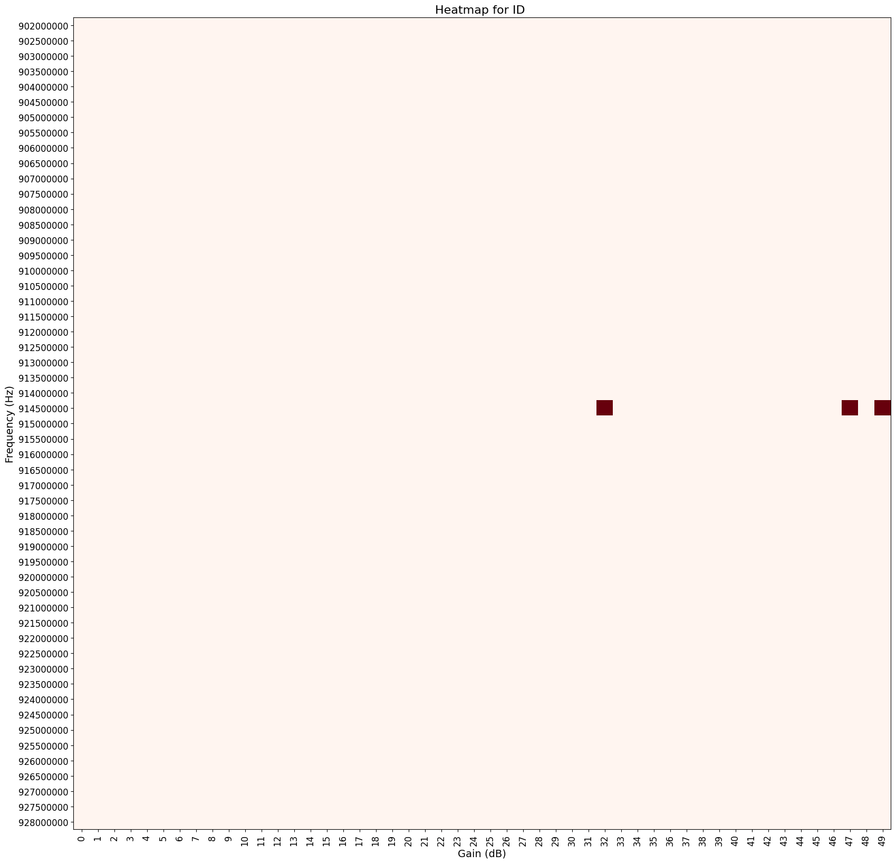
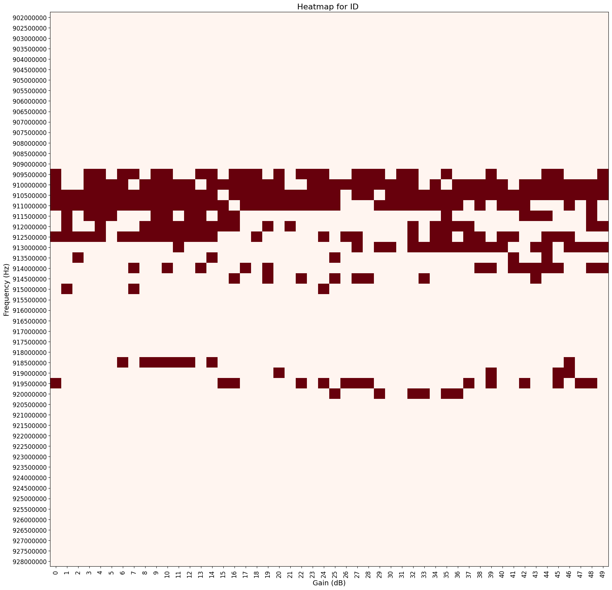
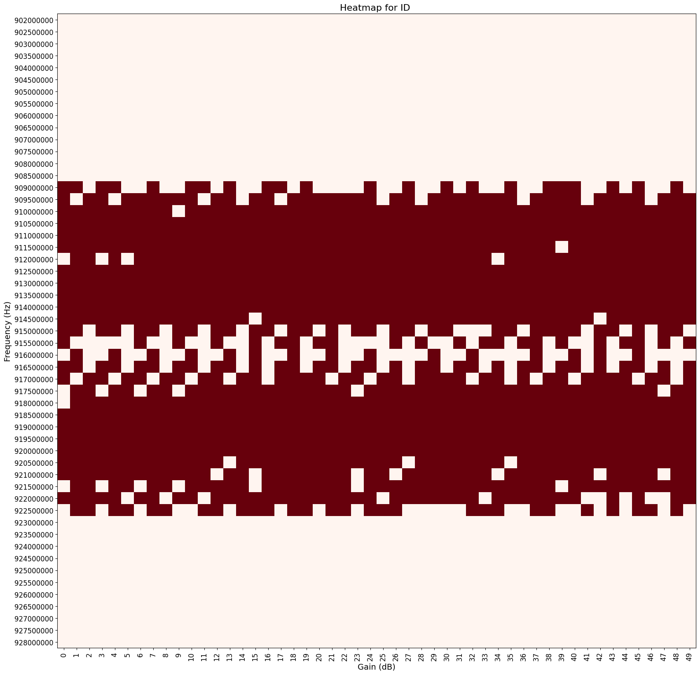
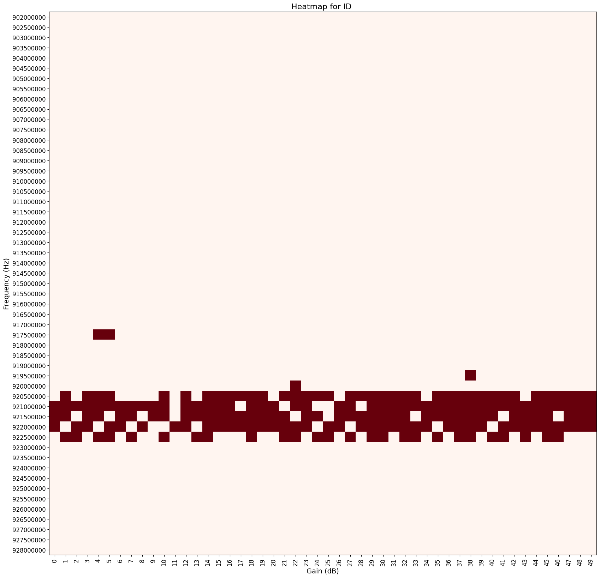

# MeterScan-Wizard
MeterScan Wizard is a powerful tool for scanning and analyzing power or gas meter signals using RTL-SDR and rtlamr. Collect frequency and gain data to optimize meter logging conditions. Easily visualize results with heatmaps. Perfect for tech enthusiasts and data analysts seeking accurate meter readings.

## Contents

- `meter_scan.sh`: Bash script to scan frequencies and gains, logging the results.
- `meter_analysis.py`: Python script to process log files and generate summaries.
- `meter_graph.py`: Python script to generate heatmaps from the summarized results.

## Installation

### Step 1: Install rtl_tcp on Windows

1. **Download and install the RTL-SDR drivers:**
   - Download the RTL-SDR drivers from [here](https://osmocom.org/projects/rtl-sdr/wiki/rtl-sdr).
   - Extract the files to a convenient location.

2. **Install the drivers:**
   - Plug in your RTL-SDR dongle.
   - Open `Zadig.exe` from the extracted files.
   - In Zadig, select `Options` -> `List All Devices`.
   - Select `Bulk-In, Interface (Interface 0)` and click `Replace Driver`.

3. **Find your WSL IP address:**
   - Open Task Manager.
   - Go to the `Performance` tab and select `Ethernet`.
   - Note the `IPv4 address`.

4. **Start `rtl_tcp`:**
   - Open Command Prompt.
   - Navigate to the directory where `rtl_tcp.exe` is located.
   - Run the following command, replacing `WSL_IP_ADDRESS` with the IP address you noted:
     ```sh
     rtl_tcp -a WSL_IP_ADDRESS
     ```

### Step 2: Set up WSL and install dependencies

1. **Install WSL:**
   - Follow the instructions [here](https://docs.microsoft.com/en-us/windows/wsl/install) to install WSL.

2. **Install Python and pip:**
   - Open WSL (e.g., Ubuntu).
   - Install Python and pip:
     ```sh
     sudo apt update
     sudo apt install python3 python3-pip
     ```

3. **Install required Python packages:**
   - Navigate to the directory containing `meter_analysis.py` and `meter_graph.py`.
   - Run the following command to install the necessary packages:
     ```sh
     pip3 install pandas matplotlib numpy
     ```

4. **Install `rtlamr`:**
   - Download `rtlamr` from [here](https://github.com/bemasher/rtlamr).
   - Extract the files and move the executable to `/usr/local/bin` to add it to your path:
     ```sh
     sudo mv rtlamr /usr/local/bin/
     ```

## Usage

### Running the Scan Script

1. **Configure the script:**
   - Open `meter_scan.sh` and replace the `ENDPOINT_ID` with your meter's endpoint ID.
   - Replace `SERVER_IP` with the WSL IP address you noted earlier.
   - Adjust the frequency and gain ranges if necessary.

2. **Run the script:**
   - In WSL, navigate to the directory containing `meter_scan.sh`.
   - Make the script executable:
     ```sh
     chmod +x meter_scan.sh
     ```
   - Run the script:
     ```sh
     ./meter_scan.sh
     ```

### Analyzing the Logs

1. **Process the log files:**
   - In WSL, navigate to the directory containing `meter_analysis.py`.
   - Run the script:
     ```sh
     python3 meter_analysis.py
     ```
   - This will generate `summary_results.csv` and `executive_summary_results.csv`.

### Generating Heatmaps

1. **Generate heatmaps:**
   - In WSL, navigate to the directory containing `meter_graph.py`.
   - Ensure `summary_results.csv` is in the same directory.
   - Run the script:
     ```sh
     python3 meter_graph.py
     ```
   - Heatmaps will be saved in the `heatmaps` directory.

## Example Heatmaps

Below are examples of heatmaps generated by the `meter_graph.py` script. These graphs show the frequency and gain combinations where signals were detected. An interesting observation is the "dead zone" in the middle frequencies, where no signals were detected. If anyone has insights into why this occurs, please feel free to share.






## Credits

- This project utilizes the [rtlamr](https://github.com/bemasher/rtlamr) tool for reading data from ERT-compatible smart meters.

## Contributing

Contributions are welcome! Please submit a pull request or open an issue to discuss improvements or new features.

## Donations

If you find this project helpful and would like to support its development, you can buy me a coffee using the link below:

<a href="https://www.buymeacoffee.com/benralph" target="_blank"></a>
